# Task Manager - Android App
Task Manager is a modern, native Android application designed to help users build and maintain positive habits. It features an intelligent task suggestion system powered by AI to help users stay productive and motivated. The app is built with a focus on clean architecture and the latest Android development technologies.

## ✨ Features
User Authentication: Secure sign-up and login using Firebase Authentication (Email/Password).

Habit & Task Management: Create, read, update, and delete daily tasks and long-term habits.

Interactive Calendar View: A full-screen calendar to visualize tasks and select specific days.

Real-time Data Sync: All data is stored and synchronized in real-time across devices using Cloud Firestore.

Modern UI: A clean, responsive, and intuitive user interface built entirely with Jetpack Compose and Material 3, supporting both light and dark modes.

Offline Support: Firestore's persistence enables users to view and manage tasks even when offline.

## 📸 Screenshots Dark Mode

  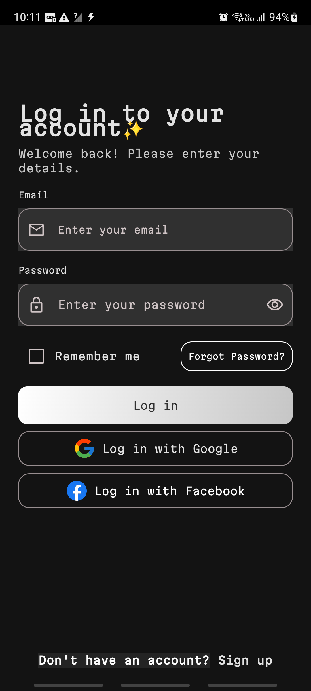
  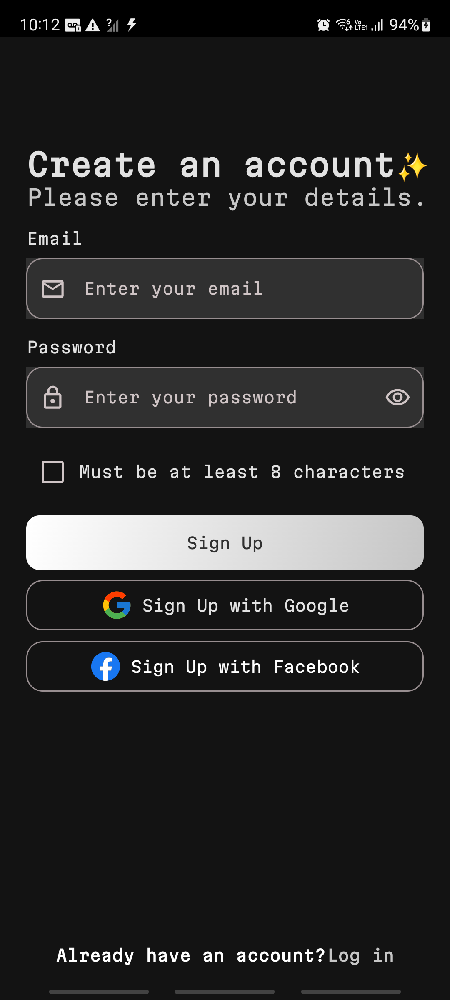
  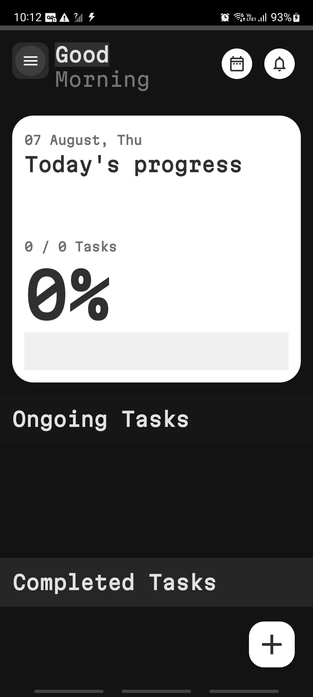
  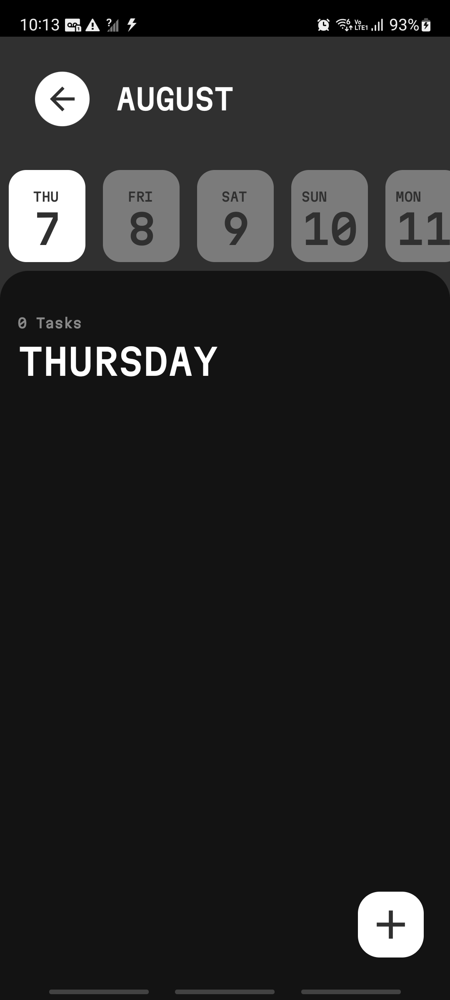
  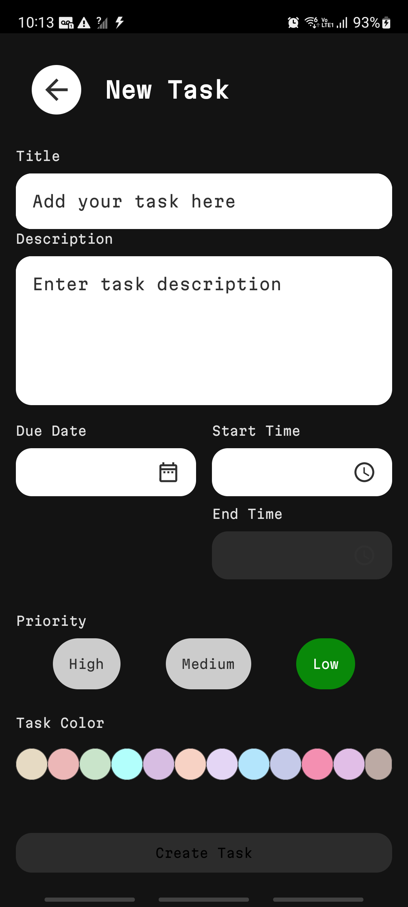
  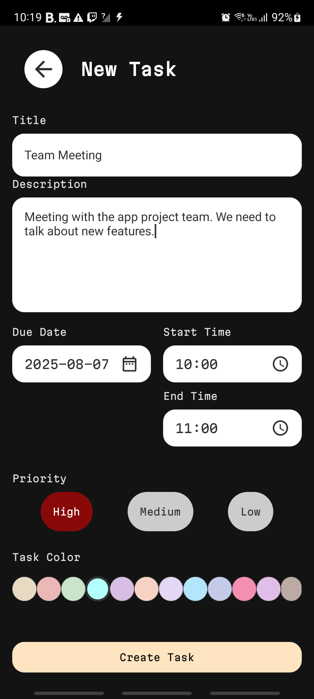

## 📸 Screenshots Light Mode

  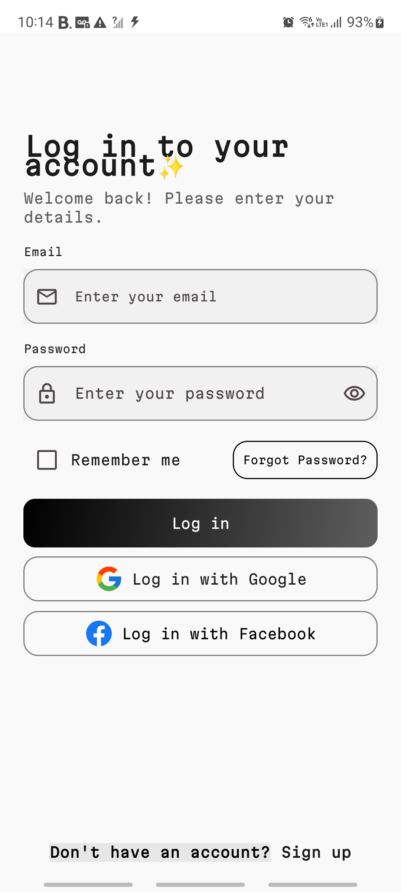
  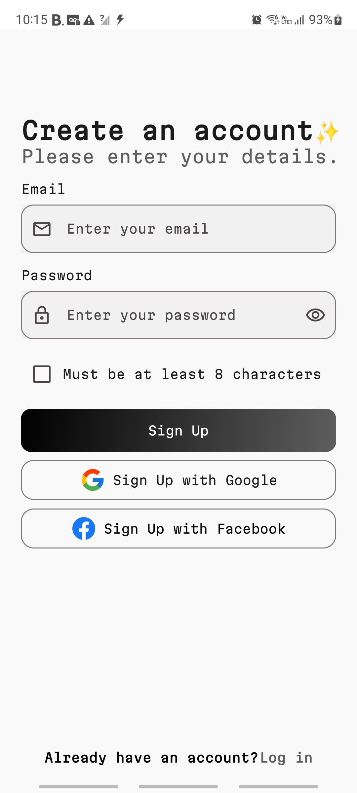
  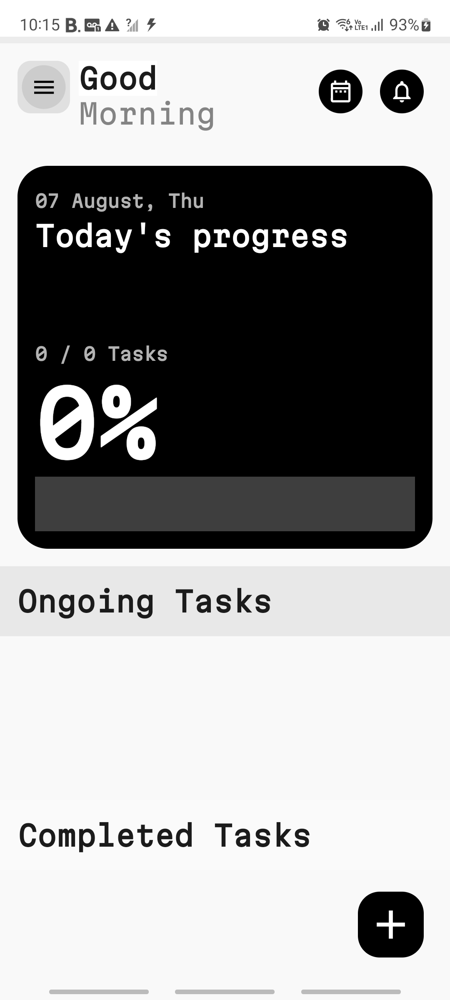
  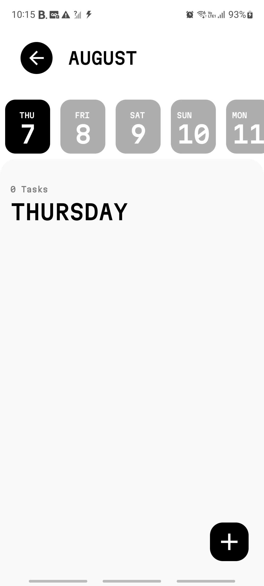
  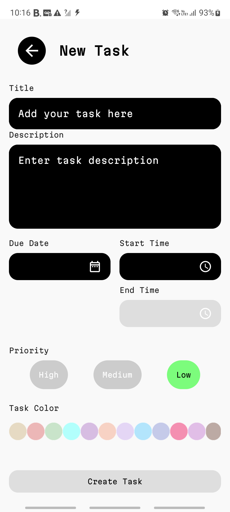

An example of the UI components:

## 🛠 Tech Stack & Architecture
This project is built with a modern tech stack and follows the principles of Clean Architecture with an MVVM (Model-View-ViewModel) pattern.

## Architecture
Clean Architecture: Separates the project into three distinct layers (Domain, Data, and Presentation) to promote separation of concerns, testability, and maintainability.

MVVM: The presentation layer uses the MVVM pattern, where the View (Composables) observes state changes from the ViewModel.

## Tech Stack
UI: Jetpack Compose with Material 3 for a fully declarative and modern UI.

Asynchronous Programming: Kotlin Coroutines and Flow for managing background threads and handling streams of data.

Dependency Injection: Hilt for managing dependencies throughout the app.

Navigation: Navigation Compose for handling navigation between screens.

Database:

Remote: Cloud Firestore for real-time, multi-user data storage.

Local: Room for offline caching.

Authentication: Firebase Authentication for secure user management.

Logging: Timber for smart and efficient logging.

## 🚀 Setup and Installation
To run this project locally, you will need to configure your Firebase backend.

### 1. Clone the repository:

git clone https://github.com/Mitdrak/TaskManager.git
cd TaskManager

### 2. Firebase Configuration:

Go to the Firebase Console and create a new project.

Add an Android app to your Firebase project with the package name com.example.taskmanager.

Follow the setup instructions to download the google-services.json file.

Place the downloaded google-services.json file in the app/ directory of this project.

Enable Services: In the Firebase console, enable Authentication (with the Email/Password provider) and Cloud Firestore.

### 3. Firestore Database Setup:

In the Cloud Firestore section of the console, create your database.

Create a root collection named users. This is where the app will store data for each user in a document identified by their unique Firebase UID.

Security Rules: Go to the "Rules" tab in Firestore and paste the following rules to ensure users can only access their own data. This is a critical security step.

rules_version = '2';
service cloud.firestore {
match /databases/{database}/documents {
// Users can only read and write their own document in the 'users' collection
match /users/{userId} {
allow read, write: if request.auth != null && request.auth.uid == userId;

      // Users can only read and write tasks within their own document
      match /tasks/{taskId} {
        allow read, write: if request.auth != null && request.auth.uid == userId;
      }
    }
}
}

### 4. Build and Run:

Open the project in Android Studio.

Let Gradle sync the dependencies.

Build and run the app on an emulator or a physical device.

## 👤 Contact
[Sergio Carriel] – [sergio.acs@hotmail.com]

Distributed under the MIT license. See LICENSE for more information.

https://github.com/Mitdrak/
